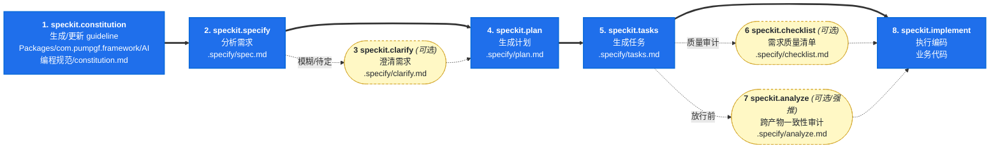
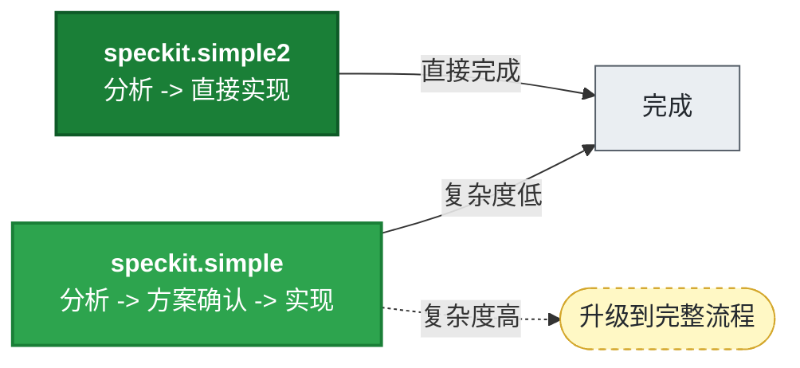

# SpecKit 工作流

> 本文件是 SpecKit 体系的**权威流程图**，供 AI 编码时参考工作流。
> SpecKit 是 [GitHub spec-kit](https://github.com/github/spec-kit) 的 Vibe Coding 工作流。
> 本文件已适配 PumpGF 框架项目结构。
>
> **注意**：
> - 框架宪法位于 `Packages/com.pumpgf.framework/AI编程规范/constitution.md`（非业务层）
> - **业务层的 SpecKit 产出**（spec/plan/tasks 等）存放在**业务项目根目录**的 `.specify/`，**不放入框架包**
> - `speckit.*/` 子文件夹是 spec-kit 的 skill 定义占位（CodeBuddy 不直接依赖，工作流思路可参考）

---

## 1. 主流程图

### 完整流程（大需求）



### 快速流程（小需求）



**选择指南**:
- **`speckit.simple`** — 小需求（1-5 文件、无新模块），有方案确认，复杂度超标建议升级
- **`speckit.simple2`** — 同样小需求，但说干就干，不等确认，超标仅标注
- **完整流程** — 大需求（跨多系统、新增模块/表）

---

## 2. 各阶段职责与产物

| 阶段 | Skill | 前置条件 | 主要产物 | 固定序号 |
|------|-------|---------|---------|---------|
| 快速 | `speckit.simple` | 无 | `.specify/<主题>/1.simple.md` + 代码 | 1 |
| 极简 | `speckit.simple2` | 无 | `.specify/<主题>/1.simple.md` + 代码 | 1 |
| 1 | `speckit.constitution` | 无 | `Packages/com.pumpgf.framework/AI编程规范/constitution.md` | — |
| 2 | `speckit.specify` | constitution 存在（推荐） | `.specify/<主题>/1.spec.md` | 1 |
| 3 | `speckit.clarify` *(可选)* | spec 已存在 | `.specify/<主题>/2.clarify.md` + 回写 spec | 2 |
| 4 | `speckit.plan` | spec 已存在 | `.specify/<主题>/3.plan.md` | 3 |
| 5 | `speckit.tasks` | plan 已存在 | `.specify/<主题>/4.tasks.md` | 4 |
| 6 | `speckit.checklist` *(可选)* | spec 已存在 | `.specify/<主题>/5.checklist.md` | 5 |
| 7 | `speckit.analyze` *(可选/强推)* | spec + plan + tasks | `.specify/<主题>/6.analyze.md` | 6 |
| 8 | `speckit.implement` | tasks 已存在 | 业务代码 + 回写 tasks 状态 | — |

> **固定序号规则**：文件名序号由 skill 类型决定，不随实际执行顺序变化。跳过的步骤不影响其他文件编号。

---

## 3. 职责边界

| Skill | 可以做 | 不可以做 |
|-------|-------|---------|
| `simple/simple2` | 分析+编码一体；写 `simple.md` | 不产出 spec/plan/tasks |
| `constitution` | 维护 `Packages/com.pumpgf.framework/AI编程规范/constitution.md` | 不改 `.specify/*`，不碰业务代码 |
| `specify` | 写/改 `spec.md` | 不生成 plan/tasks，不碰代码 |
| `clarify` | 交互问答 → 回写 `spec.md` | 不生成 plan/tasks |
| `plan` | 写/改 `plan.md` | 不生成 tasks/代码 |
| `tasks` | 写/改 `tasks.md` | 不生成代码 |
| `checklist` | 审 spec 文字 | 只追加 TODO 段落，不改正文 |
| `analyze` | 只读审计三份产物 | **绝不**修改 spec/plan/tasks |
| `implement` | 唯一有权写业务代码 | 按 tasks 编码，回写任务状态 |

---

## 4. 失败回退路径

| 失败位置 | 回退目标 |
|---------|---------|
| implement 遇到设计漏洞 | 回 `plan` 或 `tasks` |
| analyze 发现需求-计划脱节 | 回 `plan` 或 `clarify` |
| analyze 发现引用失效 | 回 `specify` 修订 |
| checklist 报 Critical | 回 `specify` 补齐 |
| clarify 发现宪法级冲突 | 回 `constitution` |
| tasks 粒度不合适 | 重跑 `tasks` |
| 需求理解错误 | 回 `specify` |

---

## 5. 产物目录结构

```
框架包（Packages/com.pumpgf.framework/AI编程规范/）：

AI编程规范/
├── constitution.md                    ← 框架宪法（框架级，AI 编码最高指导）
└── speckit/
    ├── speckit工作流.md                ← 本文件
    └── speckit.*/                     ← spec-kit skill 定义占位（CodeBuddy 不直接依赖）

业务项目根目录（非框架包内）：

<业务项目>/
└── .specify/                          ← 业务层 SpecKit 产出（不放入框架包）
    └── <主题>/                        ← 按主题分目录
        ├── 1.spec.md                  ← speckit.specify
        ├── 1.simple.md                ← speckit.simple / simple2
        ├── 2.clarify.md               ← speckit.clarify
        ├── 3.plan.md                  ← speckit.plan
        ├── 4.tasks.md                 ← speckit.tasks
        ├── 5.checklist.md             ← speckit.checklist
        └── 6.analyze.md               ← speckit.analyze
```

---

## 6. 公共纪律（所有 speckit.* 必须遵守）

1. **动态探索项目结构** — 通过 Glob/Grep/Read 发现项目布局，不硬编码路径
2. **以 constitution 为合规基准** — 读取 `Packages/com.pumpgf.framework/AI编程规范/constitution.md` 获取项目规范和约束
3. **禁止整读大文件** — 协议文件、生成代码、大型配置等只能按关键字 Grep
4. **对齐项目现状** — 引用的文件/类/方法必须真实存在（Glob/Grep 验证）
5. **文档语言与格式** — 简体中文 + 标准 Markdown
6. **引用格式** — 文件引用使用 Markdown 链接指向真实路径
7. **宪法变更唯一通道** — 修改宪法必须走 `/speckit.constitution`

---

> 若本文件与任一 `speckit.*/SKILL.md` 存在不一致，以**本文件为准**。
